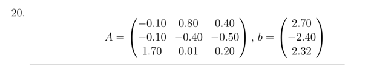

# Лабораторная работа 3 

> Численные методы, Горбунов Миша, КН-401

## Задача:

Решить систему линейных уравнений вида `Ax = b`, используя точные и итерационные
методы:

1. Метод Гаусса;
2. Метод Гаусса с выбором главного элемента по всей матрице;
3. Метод Якоби;
4. Метод Гаусса-Зейделя. 
   
В отчете:
- В методах 1,2 сравнить результаты решения; 
- Для методов 3, 4 проверить сходимость метода; в случае сходимости найти решение с точностью 0.5 · 10−4 ; сравнить количество итераций.

Мой вариант - 20

Мои A и B:



## Решение

### 1. Метод Гаусса: 

> Решал через онлайн-сервис, выкладки в `papers/PAPERS.md`

```
x1 = 1
x2 = 2
x3 = 3
```

### 2. Метод Гаусса с выбором главного элемента

> Выкладки в `papers/PAPERS.md`

```
x1 = 
x2 = 
x3 = 
```

### Сравнение результатов решения 1 и 2

### 3. Метод Якоби

Переставим строки исходной матрицы таким образом, чтобы наибольшие по модулю элементы стояли на главной диалгонали.

```
 1.70  0.01  0.20 |  2.32
-0.10  0.80  0.40 |  2.70
-0.10 -0.40 -0.50 | -2.40
```

На такой матрице выполняется условие диалгонального преобладания, это достаточно для того, чтобы метод Якоби сходился.

Напишем скрипт...

```shell
> node index.js

Jacobi Method:
result: 1.0000026340820203, 2.0000109978239924, 3.0000024740602385, iterations 27
```

### 4. Метод Гаусса-Зейделя

Домножим обе части уравнения на А* (матрицу, сопряженную A) и получив систему вида A'x = b', где A' = A*A, а b' = A*b,

Корни этой системы сопадают со старой, но матрица A' будет являться положительно-определенной, что будет гарантировать сходимость метода.

Напишем скрипт...

```shell
> node index.js
 
Seidel Method:
result: 1.0000018268076136, 2.000008481765478, 2.9999928492260945, iterations 15
```

### Сравнение количества итераций 3 и 4

При одинаковых входных данных -- одна матрица, один eps, одно начальное приближение, метод Зейделя работает с меньшим количеством итераций.

### Запуск кода

`node index.js`